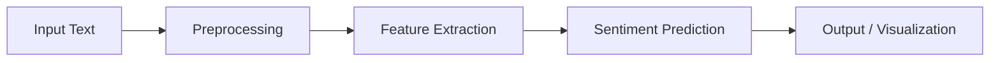
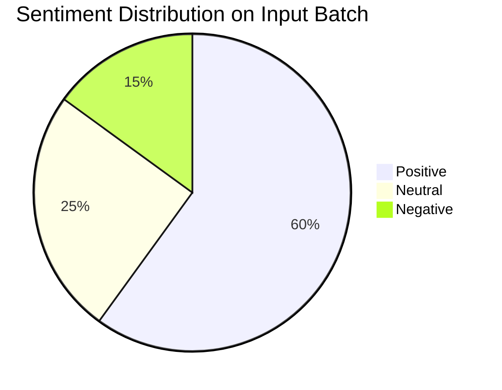

# Sentiment Analysis Project

Analyze textual data and determine its sentiment—**positive**, **negative**, or **neutral**—using state-of-the-art Natural Language Processing (NLP) techniques.

---

## 🚀 Overview

This project provides a robust pipeline for processing, analyzing, and classifying sentiments from text data such as product reviews, social media messages, or customer feedback.

---

## 🛠️ Features

- **Automated Text Processing:** Tokenization, cleaning, and vectorization.
- **Customizable Models:** Supports classical ML or deep learning approaches (e.g., Logistic Regression, SVM, or BERT).
- **Easy Integration:** Simple CLI and optional Web API for real-time inference.
- **Visualization:** Built-in output charts for insight into sentiment patterns.

---

## 📈 Project Flow



1. **Input Text:** Raw text data (e.g., reviews).
2. **Preprocessing:** Cleaning, normalization, and tokenization.
3. **Feature Extraction:** Transformation into numerical features (e.g., TF-IDF, embeddings).
4. **Sentiment Prediction:** Prediction by a trained model.
5. **Output / Visualization:** Display of results (class and confidence).

---

## 🏗️ System Architecture

```mermaid
graph TD
    UI[User Interface (CLI/Web)]
    API[API Service]
    MODEL[Sentiment Model]
    DB[(Optional Storage)]

    UI --> API --> MODEL
    MODEL --Results--> API
    API --(Optional Logging)--> DB
```

---

## ⚙️ Installation

```bash
git clone https://github.com/your-username/sentiment-analysis-project.git
cd sentiment-analysis-project
pip install -r requirements.txt
```

---

## ▶️ Usage

### 1. Command-line Example

```sh
python main.py --text "The support was outstanding and prompt!"
```
You’ll see output in the console, such as:
```
Text: The support was outstanding and prompt!
Predicted Sentiment: Positive
Confidence: 92%
```

### 2. Web Interface Example

- Run: `python app.py`
- Open your browser at `http://localhost:5000`
- Enter your text and click “Analyze”

---

## 🖥️ Example Outputs

### Console Output

| Input Text                                    | Predicted Sentiment | Confidence |
|-----------------------------------------------|---------------------|------------|
| "Terrible product. It broke immediately."     | Negative            | 97%        |
| "Works as expected. Satisfied with the value."| Positive            | 88%        |
| "It's okay, not great but not bad."           | Neutral             | 75%        |

### Web Visualization

Bar Chart (example):



**What these outputs show:**
- The *Predicted Sentiment* is the classification label assigned to your input text.
- The *Confidence* value is the model’s probability or certainty in its prediction.
- The *Sentiment Distribution* chart (if supported) visually summarizes the makeup of a batch of texts.

---

## 📦 Sample Data

The project supports any `.csv` with a `text` column (and optionally a `label` column for evaluation).

---

## 🤝 Contributing

Contributions are welcome! Please open issues or submit pull requests with suggested changes.

---

## 📄 License

[MIT License](LICENSE)
